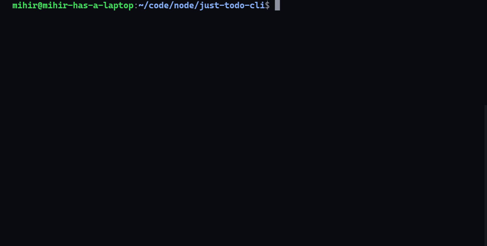

# todo-cli

Simple. Minimal. To-Do. CLI.




### Requirements:

- Install NodeJS (<https://nodejs.org/en/>)

### Installation:

    npm install -g just-todo-cli

**Note:** Installing the CLI will create 2 files (tasks.db, userSettings.db) to store data, I would suggest running the above command inside a folder.
That's it. Just open the terminal/cmd and type in: `todo`

## Commands

```
Usage: todo [options] [command] [task]

To-Do List CLI

Options:
  -a, --add     add a task
  -h, --help    display help for command
  -l, --list    list all tasks
  -r, --remove  remove a task
  -u, --update  update a task

Commands:
  reset         Reset the ToDo CLI Database
```
